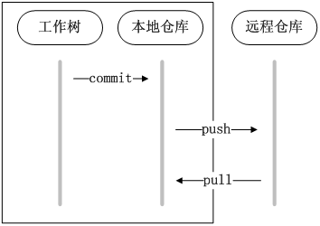

### GITHUB使用指南

 - 安装eclipse插件EGit，或者直接使用eclipse的luna版本（该版本自带EGit插件）
 
 - 安装git程序
 
 - 在本地新建目录，比如D:/github，进入到该目录中，在当前目录打开git命令行
  在命令行执行:
  
  ```  
  git clone http://rnd-github.huawei.com/z00229725/TopoComponent
  ```
  
  执行该命令是为了从github上迁出TopoComponent到本地。
 - 打开eclipse，制定workspace为D:\github\TopoComponent
 
 - 在eclipse中配置EGit
 
 - 在eclipse中配置tomcat
 
到此Topo组件的代码在本地搭建完成。
 
##### 1. 推送远程仓库  
克隆服务器端仓库后，会在本地建立一个一样的仓库，称本地仓库。在本地进行commit操作将把更新提交到本地仓库，然后可以将服务器端的更新pull到本地仓库进行合并，最后将合并好的本地仓库push到服务器端，这样就进行了一次远程提交。



##### 2. 分支概念
在git中分支是一个很重要的概念。
分支就是科幻电影里面的平行宇宙，当你正在电脑前努力学习Git的时候，另一个你正在另一个平行宇宙里努力学习SVN。
如果两个平行宇宙互不干扰，那对现在的你也没啥影响。不过，在某个时间点，两个平行宇宙合并了，结果，你既学会了Git又学会了SVN！

分支在实际中有什么用呢？假设你准备开发一个新功能，但是需要两周才能完成，第一周你写了50%的代码，如果立刻提交，由于代码还没写完，不完整的代码库会导致别人不能干活了。如果等代码全部写完再一次提交，又存在丢失每天进度的巨大风险。

现在有了分支，就不用怕了。你创建了一个属于你自己的分支，别人看不到，还继续在原来的分支上正常工作，而你在自己的分支上干活，想提交就提交，直到开发完毕后，再一次性合并到原来的分支上，这样，既安全，又不影响别人工作。

##### 3. 分支策略
在实际开发中，我们应该按照几个基本原则进行分支管理：

首先，master分支应该是非常稳定的，也就是仅用来发布新版本，平时不能在上面干活；

那在哪干活呢？干活都在dev分支上，也就是说，dev分支是不稳定的，到某个时候，比如1.0版本发布时，再把dev分支合并到master上，在master分支发布1.0版本；

你和你的小伙伴们每个人都在dev分支上干活，每个人都有自己的分支，时不时地往dev分支上合并就可以了。

所以，团队合作的分支看起来就像这样：


##### 4. 分支切换
git可以很方便的进行分支之间的切换。
